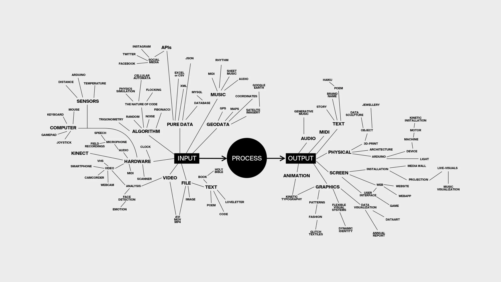
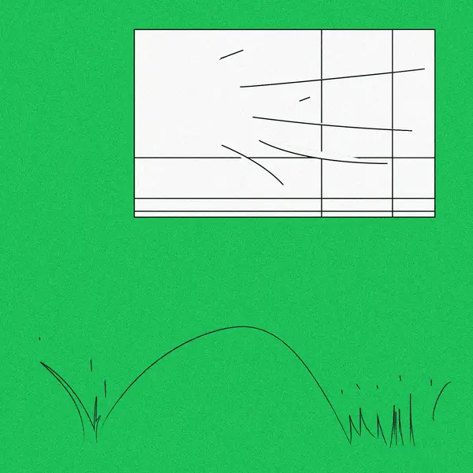

### Context

I am thinking how can I use what I have learned to contribute to better front end design, and looks back, what I have learned in react is very interesting already, I remember some concepts like map for generative UI, or virtual DOM, how hooks work.

Like this is what I actually want to do:)

### Review 


This looks really fun.. I know it is not practical, but like it is pretty much what we know of the context of data design is


I was also just so inspired by her work, the connection betweend diagram and creative/generative expression, is literally like a framework I can borrow in the .map part.



I think I also just very like the style of these illustrations, like how abstract they are, another example is [woshibai](https://woshibai.bigcartel.com/)

### Gap
I'm thinking about like what.. what would actually be useful you know? Seems like a lot of times we are making art, and when I talk about this everything becomes boring ugh.

### Developing a thought

#### 01-on train
I don't have internet on the train, so to conceptualize, I have to use my dry brain. But after reading some of the learning notes, I think what makes me feel itchy is to write ... something... that uses the language of react... to describe... a design. something like

```jsx
// jolly
// has 10 fingers
// if 11
// you are looking at a generative image of her -> map like toe image with like.. idk like a 5 structure of some sort
```
or 
```jsx
// i like swiss style 
// because it holds things in grid -> mapping something to the grid?
```
or 
```jsx
// i read books 
// but not all the time
// sometimes I wonder if people read, like, all the time
// it is kind of giving me bad fomo
```
or 
```jsx
// yeah the weather has been so unstable recently
// i don't know if the god is mad at me
// and i can't control myself being happy when the sun is out 
```
So when I write down these thought, I have a good feeling, I feel like I am expressing my understanding of the world from my perspective, and I am inviting people to understand me. Maybe the language is a link between the world's other cornors (data sources) and the audience (interaction)

So I am imagining.. small react "poems" that you not just read... but interact with... you feel... the expansion of the language...

And maybe it is a new sort of language, hm, make it intuitive, make it visual, make it like it is saying something

#### 02-here it comes, the annoying part
So honestly I don't know if it is good idea at all to start this initiative.

I don't know what am I making.

And I initiated a react project, and it is overwhelming, i dont even wanna start.

Ok I went to the bathroom and i saw lights from outside reflecting on the ground and I like that. What about we try something about weather yes, and then we also add the idea of "line" into it, like you know so normally you have like notebook lines, sometimes you get underline style in app, but now it is dynamic, itself is carrying message...

like...

```
<component of a line>
    //we do something simple, we map the line..
    // and then your curcor movement makes them aware...
    // (so like we can create wind? just a couple of lines, and you can use cursor accelerator to blow it? hahaha like when you pass the bus station you would like..blow something on someone)
<the component>

we call it
    whenever the user type something?
    OR this could be like a continous like comic... you know you... use your cursor to interact with it.

@/ in s helper that generates the lines based on what user types

@/ and in the HTML, you draw like a 2x3 grid, responsive, in each comic grid you have this responsive narrative
```